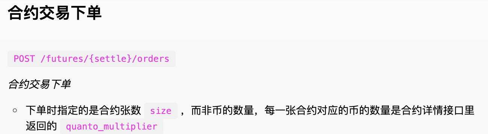
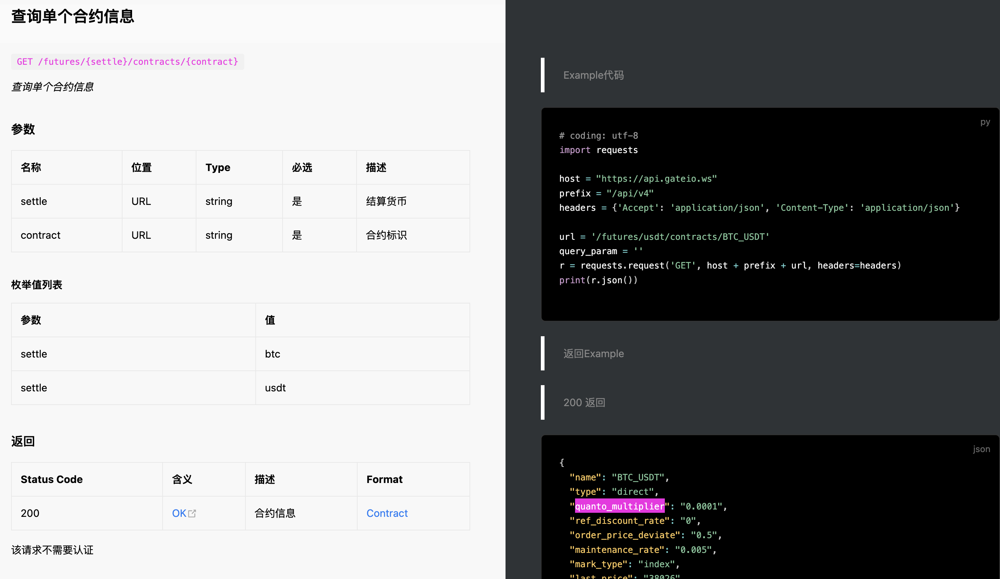

# 🧠 Quant Orderbook Collector

三人量化小队 · Orderbook Collector 文档

老任务需完成

- [] dYdX lighter 的orderbook函数
- [x] 王子币安config文件问题

## 新任务：合约信息文件夹： contracts_information

在探索API文档中的下单部分时，发现一个重要问题：

也就是说，我们需要合约的详情信息来指导我们的下单操作！！

如何知道？

以gate为例，找到api文档中的查找永续合约信息的部分，填写相关函数，将合约信息以json文件的格式保存到contracts_information中去。这样我们就可以从Executor就可以从Data_collector文件夹中查询必要的信息了！！

to do list：
- [x] 制定函数总规范，在各个交易所文件里以及main_collector.py里添加相关函数 （纪柯熠） 已完成，请大家查看各个orderbook文件和main_collector.py文件
- [] 完成交易所文件函数的编写（纪柯熠 杨明和 王子逸）

